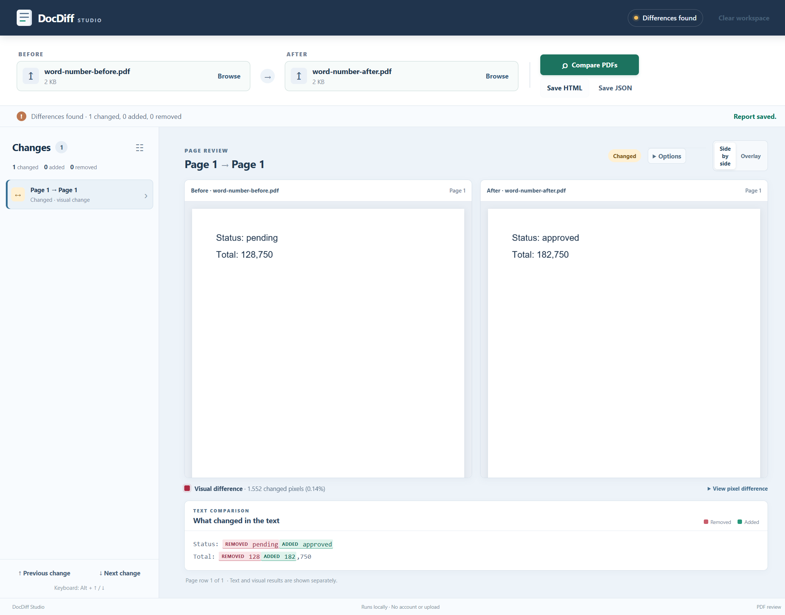

# DocDiff Studio

Compare two document revisions locally, inspect text and visual changes, and save a report that opens without an account or server.

[](https://github.com/Pastalikek65/docdiff-studio/actions/workflows/ci.yml)

DocDiff is for reviewing revised manuals, proposals and other documents where a changed number, word or page matters. The [published feature beta](https://github.com/Pastalikek65/docdiff-studio/releases/tag/v0.2.0) provides tested Windows and Linux x64 archives for PDF, supported DOCX, selected-page local English OCR and sequential batches. Download the latest qualified build from [Releases](https://github.com/Pastalikek65/docdiff-studio/releases). See the [support contract](docs/support.md) and [roadmap](docs/roadmap.md).



See the [generated example HTML report](examples/outputs/comparison.html) or compare the included PDFs yourself. The screenshot and report come from the real desktop acceptance flow.

See the real [DOCX paragraph/table review](examples/outputs/docx-review.png), [DOCX HTML report](examples/outputs/docx-comparison.html) and [local OCR review](examples/outputs/ocr-review.png) from its actual Windows desktop flow. These examples show actual behavior. The feature beta has passed exact-package qualification; stable releases additionally require old-preview profile/report compatibility.

## Install

Download the archive for your platform from [Releases](https://github.com/Pastalikek65/docdiff-studio/releases) and verify it with the release's `SHA256SUMS.txt`. On Windows, extract the complete ZIP and run `DocDiff Studio.exe`. Linux setup requires the sandbox permissions and application-specific AppArmor instructions in the release notes. Archives are unsigned; Node.js is not needed for the packaged app.

Each qualified release includes `verification.json` with exact source/package hashes and successful source and extracted-package flows on Windows Server 2025 and Ubuntu 24.04. The same Windows archive additionally passed on Windows 11. The release record distinguishes previews from stable versions; use the evidence for your exact downloaded build.

## Run development source

Requirements: Node.js 24, npm, Windows x64 or a Linux x64 graphical session. No paid API or application account is needed.

```sh
npm ci
npx install-electron --no
npm run build
npm start
```

For your first comparison, select `examples/corpus/word-number-before.pdf` as Pair 1's original and `word-number-after.pdf` as its revision, then choose **Compare pair**. Inspect removed/added text and page images, and use **Save selected HTML** to create a self-contained report. For the inserted-page example, use the two `insert-middle-*` PDFs: later pages should stay paired with their original pages. The tagged v0.1.0 preview labels these controls **Compare PDFs** and **Save HTML**.

[Türkçe hızlı başlangıç](docs/quickstart.tr.md) · [Support and limitations](docs/support.md) · [Contributing](CONTRIBUTING.md)

## Review behavior

- Side-by-side page previews, a visual difference layer, and a change list with page navigation.
- Separate text and appearance comparisons. Ignoring whitespace or selected header/footer lines does not hide visible appearance changes.
- Middle-page insertions and removals are aligned independently of page numbering.
- Pages with no extracted text stay visible as **Review needed**; matching images do not prove that scanned documents have the same text. Partial extraction on a text-bearing page cannot be detected reliably, so inspect the page previews.
- DOCX main-body paragraphs and basic table cells, with logical locations and explicit incomplete-content warnings.
- Exact unique-text moves; repeated boilerplate stays ambiguous.
- Optional bundled English OCR on selected PDF pages without a text layer; matching OCR text stays uncertain.
- Up to 20 sequential pairs and batch JSON that preserves failed, cancelled and not-run states.
- HTML with embedded images and versioned JSON, generated on this device.
- Cancellable worker processing, input/page/pixel/text/output limits, and explicit failed states.

Files are read only when selected. The desktop blocks external requests and navigation; parsing happens in a worker inside a sandboxed renderer. Reports contain document names, SHA-256 fingerprints, text and images, so treat exported reports as copies of potentially private documents. No telemetry or file-upload backend is included.

## Development and evidence

```sh
npm run typecheck
npm test
npm run test:e2e
npm run package
```

The corpora are synthetic and reproducible with `npm run fixtures` and `npm run fixtures:v1`; their manifests bind bytes to expected behavior. End-to-end tests exercise actual PDF decoding, worker comparison, native save IPC with a simulated dialog choice, and reopening the produced HTML. Test evidence belongs to the exact tested build; a successful compile alone is not package acceptance. Unsigned archives and tested platform scope will be stated with each release.

Authored code and corpus: Apache-2.0. See [third-party notices](THIRD_PARTY.md) for bundled components, fonts and corresponding font source.
